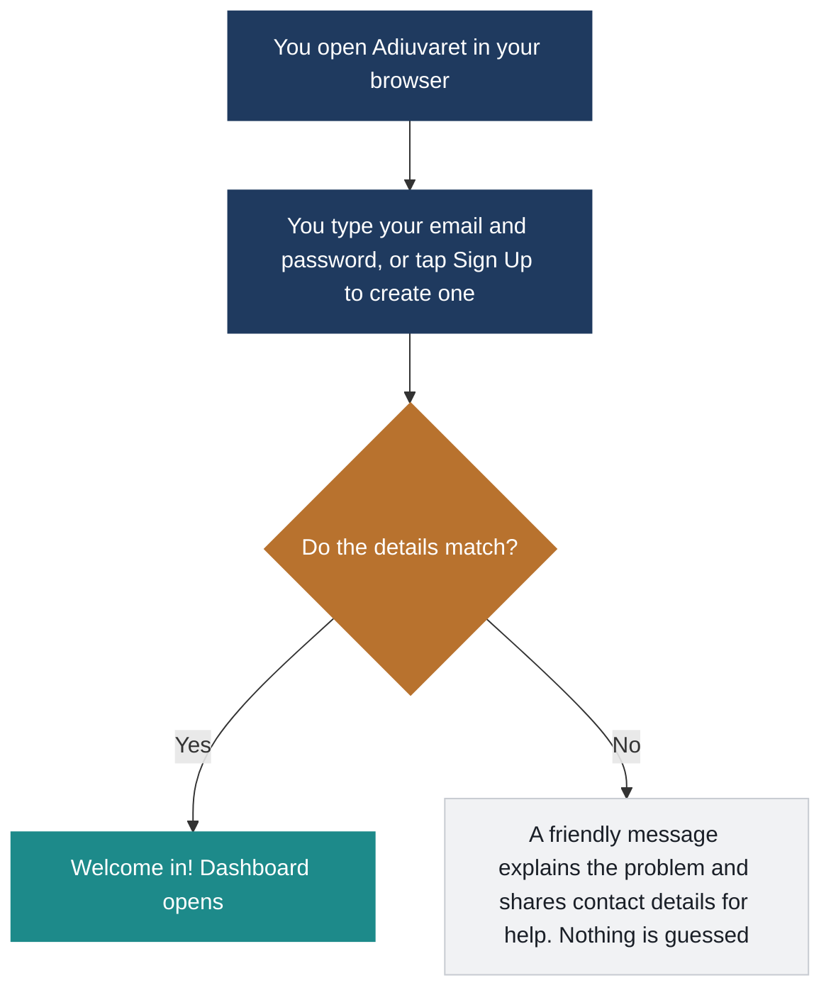
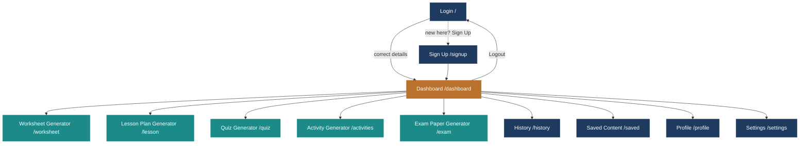
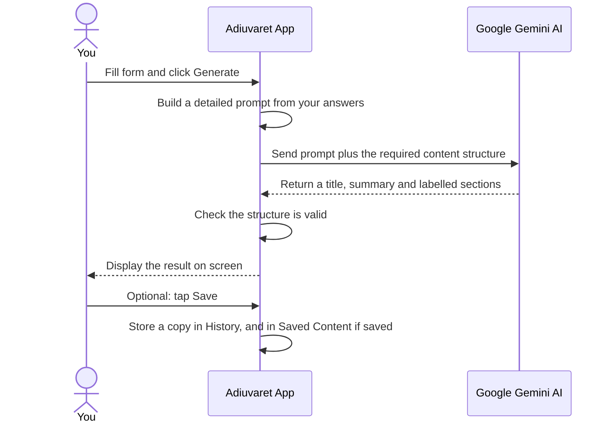
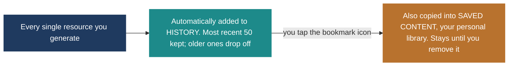
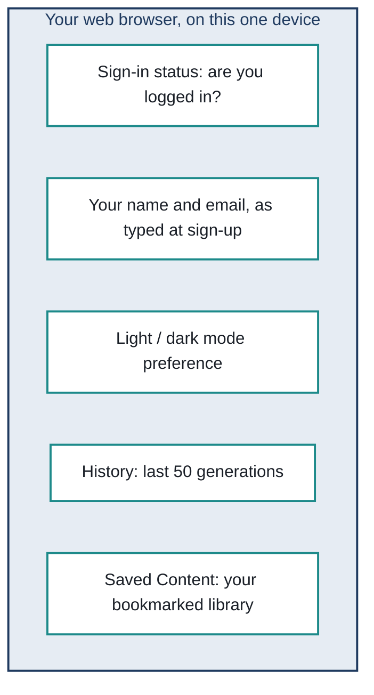

# Adiuvaret AI Classroom Generator — Complete Feature Guide

*Written in plain language — no technical background required.*

**Prepared for:** info@adiuvaret.in
**Document date:** 5 August 2026
**Covers:** Login & Sign Up · Dashboard · Worksheet, Lesson, Quiz, Activity & Exam Paper Generators · History · Saved Content · Profile · Settings

---

## Viewing this document

This file uses [Mermaid](https://mermaid.js.org) code blocks for every diagram instead of picture files, so the diagrams stay text-based and easy to update. To see them rendered as actual boxes and arrows (not code), open this file in one of these:

- **GitHub or GitLab** — open the file in your browser; diagrams render automatically, no setup needed.
- **VS Code** — install the free "Markdown Preview Mermaid Support" extension, then open the built-in preview (`Ctrl+Shift+V`).
- **Obsidian** — renders Mermaid natively, no extension needed.
- **Quick one-off check** — copy any single ```` ```mermaid ```` block into [mermaid.live](https://mermaid.live) to preview it instantly.

If you're just reading the raw text with no Mermaid support, each diagram's code block still describes the flow step by step — read it top to bottom.

---

## Contents

1. [About This Guide](#1-about-this-guide)
2. [What Is Adiuvaret?](#2-what-is-adiuvaret)
3. [The Big Picture — How Everything Fits Together](#3-the-big-picture--how-everything-fits-together)
4. [Getting In — Login & Sign Up](#4-getting-in--login--sign-up)
5. [The Home Screen — Dashboard & Full Site Map](#5-the-home-screen--dashboard--full-site-map)
6. [The Engine Room — How AI Content Gets Made](#6-the-engine-room--how-ai-content-gets-made)
7. [Worksheet Generator](#7-worksheet-generator)
8. [Lesson Plan Generator](#8-lesson-plan-generator)
9. [Quiz Generator](#9-quiz-generator)
10. [Classroom Activity Generator](#10-classroom-activity-generator)
11. [Exam Paper Generator](#11-exam-paper-generator)
12. [History](#12-history)
13. [Saved Content](#13-saved-content)
14. [Profile](#14-profile)
15. [Settings](#15-settings)
16. [Where Your Data Lives & Important Things to Know](#16-where-your-data-lives--important-things-to-know)
17. [Quick Reference — Every Page at a Glance](#17-quick-reference--every-page-at-a-glance)
18. [Plain-English Glossary](#18-plain-english-glossary)
19. [Appendix — Class & Subject Coverage](#19-appendix--class--subject-coverage)

---

## 1. About This Guide

This document explains every screen and feature in Adiuvaret from a user's point of view. It does not assume any coding knowledge — wherever something technical happens behind the scenes (like the AI writing content, or information being saved), it is explained in everyday language, with a diagram showing the steps in order.

Each feature section follows the same pattern:

- **What it's for.** The everyday purpose of the screen, in one or two sentences.
- **How it works.** A step-by-step walkthrough, paired with a flow diagram where the steps aren't obvious.
- **What you fill in.** For the AI tools, a table of every field on the form and what to type there.
- **Good to know.** Practical notes, limits, and anything that might surprise a first-time user.

> **Who this is for:** Teachers and staff using the app day-to-day, and anyone reviewing the product who wants to understand what it does without reading source code.

---

## 2. What Is Adiuvaret?

Adiuvaret is a web app that helps teachers create classroom-ready materials in minutes instead of hours. You choose what you need — a worksheet, a full lesson plan, a quiz, a set of activity ideas, or an exam paper — fill in a short form (class, subject, topic, and a few preferences), and an AI model (Google's Gemini) writes a complete, structured resource for you to review, tweak, and use.

It runs entirely in your web browser. There is no company server behind it storing your account or your generated content — everything is kept on the device and browser you're using, and every request for new content is sent straight from your browser to Google's Gemini AI service over the internet.

At a glance, Adiuvaret gives you five generators and three supporting spaces to manage what you create:

- **Generators:** Worksheet, Lesson Plan, Quiz, Classroom Activity, Exam Paper.
- **Supporting spaces:** History (an automatic log of everything you generate), Saved Content (your personal library), and Profile / Settings (your identity and preferences).

---

## 3. The Big Picture — How Everything Fits Together

Every visit to Adiuvaret follows the same overall journey, no matter which generator you end up using.

```mermaid
flowchart LR
    A["1. Open the app and log in"] --> B["2. Land on the Dashboard, the home screen"]
    B --> C["3. Pick a tool: Worksheet, Lesson, Quiz, Activity or Exam"]
    C --> D["4. Fill a short form: class, subject, topic..."]
    D --> E["5. Click Generate, the AI writes the resource"]
    E --> F["6. Review on screen and Save the ones worth keeping"]
    F --> G["Everything lands in History. The keepers go to Saved Content"]

    classDef navy fill:#1F3A5F,color:#ffffff,stroke:#1F3A5F,stroke-width:1px;
    classDef teal fill:#1D8A8A,color:#ffffff,stroke:#1D8A8A,stroke-width:1px;
    classDef amber fill:#B8722E,color:#ffffff,stroke:#B8722E,stroke-width:1px;
    classDef muted fill:#F1F2F4,color:#1A1F27,stroke:#C7CBD1,stroke-width:1px;

    class A,B,F navy
    class C,D teal
    class E amber
    class G muted
```



*Figure 1 — The complete Adiuvaret journey, from opening the app to keeping the results you want.*

Two things are worth noting about this journey. First, steps 3 through 6 can repeat as many times as you like in one session — you can generate a worksheet, then immediately switch to the Quiz tool, then come back and regenerate the worksheet with different settings. Second, saving (the last box) is always optional: everything you generate is kept automatically in History regardless of whether you save it.

---

## 4. Getting In — Login & Sign Up

**What it's for:** The very first screen you see. It confirms who you are before letting you into the rest of the app.

### How it works



*Figure 2 — What happens when you try to sign in.*

On the Login screen you type an email and password and press Login. There is also a Sign Up screen for creating a new profile, and a "Continue with Google" button that currently just shows a message explaining that Google sign-in isn't connected yet.

### What you fill in

| Field | What it means |
|---|---|
| Email | Your teacher email address. |
| Password | Your password. Tap the eye icon to reveal it while typing. |
| Remember Me | A checkbox on the Login screen (visual only — it doesn't change how long you stay signed in). |

### Good to know

> **Warning — this is a demo-level login, not a secure account system.** The Login screen checks your details against a single fixed email and password that the developer set up (currently `adiuvaret@gmail.com` / `adiuvaret@123`) — it is not checking a real list of registered users. The Sign Up screen, on the other hand, does not check against anything: any name, email, and matching password you type will successfully "create an account" and log you straight in. Before real teachers rely on this for anything sensitive, this should be replaced with a proper account system.

- Signing out (via the Logout link in the side menu) simply forgets that you were logged in — it does not delete any of your History or Saved Content.
- If your device or browser is shared, anyone who opens Adiuvaret on it while you're still signed in can see your data, because there's no automatic timeout.

---

## 5. The Home Screen — Dashboard & Full Site Map

**What it's for:** Your landing page after logging in — a launchpad to every generator, plus a quick look at what each tool does.

### What's on the screen

- **Welcome banner.** A "Start creating" button that jumps straight into the Worksheet Generator, and a "Customize experience" button that opens Settings.
- **Quick stats.** Three headline numbers (resources generated, teachers supported, average time saved) shown for illustration.
- **Tool cards.** One card per generator — Worksheet, Lesson Plan, Quiz, and Classroom Activity — each a shortcut to that tool. (The Exam Paper Generator lives in the side menu rather than as a card here.)
- **Feature tabs.** Tap Worksheet / Lesson / Quiz / Activity to read a one-line description of what that tool is best used for.

Every other page in the app — including all five generators — shares the same layout as the Dashboard: a side menu on the left for navigating anywhere, and a top bar with search, a theme switch, and your profile.

### Full site map



*Figure 3 — Every page in Adiuvaret is one click away from the Dashboard via the side menu; Logout always returns you to the Login screen.*

---

## 6. The Engine Room — How AI Content Gets Made

All five generators (Worksheet, Lesson, Quiz, Activity, Exam Paper) work the same way under the hood. Understanding this once means you understand what's happening on every single generator page.

```mermaid
flowchart LR
    A["You fill in the form and click Generate"] --> B["The app turns your answers into detailed written instructions"]
    B --> C["Instructions travel over the internet to Google's Gemini AI"]
    C --> D["Gemini writes a complete, ready-to-use resource and sends it back"]
    D --> E["The app checks the answer is well-formed, then displays it neatly"]
    E --> F["You review it on screen, regenerate if needed, and tap Save to keep it"]

    classDef navy fill:#1F3A5F,color:#ffffff,stroke:#1F3A5F,stroke-width:1px;
    classDef teal fill:#1D8A8A,color:#ffffff,stroke:#1D8A8A,stroke-width:1px;
    classDef amber fill:#B8722E,color:#ffffff,stroke:#B8722E,stroke-width:1px;

    class A,E,F navy
    class B,C teal
    class D amber
```



*Figure 4 — The same five-step pipeline runs behind every "Generate" button in the app.*

Here's the same journey again as a conversation between you, the app, and the AI — useful if you prefer to follow it as a sequence of messages rather than boxes:



*Figure 5 — The same process, shown as a message-by-message sequence.*

In plain terms:

1. You fill in a short form specific to the tool you're using (for example, class, subject, topic, and difficulty for a worksheet).
2. The app converts those answers into a detailed written instruction — essentially a very specific request — tailored to the type of resource you asked for.
3. That instruction is sent over the internet to Google's Gemini AI, along with a strict template describing exactly what shape the answer should take (a title, a short summary, and a set of clearly labelled sections).
4. Gemini writes the content and sends it back in that exact structure.
5. The app double-checks the structure is valid, adds a small helpful note (like an estimated time or difficulty), and displays everything neatly on screen — ready to read, regenerate, or save.

### If something goes wrong

The app never fails silently. Instead of a blank screen or a technical crash, you'll see one of these plain-language messages:

| Situation | What you'll see |
|---|---|
| No internet connection reaches Gemini | "Couldn't reach Gemini. Check your internet connection and try again." |
| The request takes too long (over 30 seconds) | "The request to Gemini timed out. Try again." |
| The AI key set up by the developer is missing | "No Gemini API key found" — a setup issue for the developer to fix, not something you caused. |
| The AI key is invalid or rejected | "Your Gemini API key was rejected" — again, a setup issue. |
| Too many requests sent in a short time | "Gemini's rate limit was reached. Wait a moment and try again." |
| The AI's answer was too long and got cut off | A message suggesting you reduce the number of questions or simplify the request. |
| Anything else unexpected | "Something went wrong while generating this. Try again." |

Every error screen includes a "Try again" button, so you never have to leave the page or lose the form details you already typed in.

---

## 7. Worksheet Generator

**Where to find it:** Side menu → Worksheet Generator (page address: `/worksheet`)

**What it's for:** Turns any topic into a printable practice worksheet, scaled to a class and difficulty level you choose.

### What you fill in

| Field | What it means |
|---|---|
| Class | PG, Nursery, LKG, UKG, or Class 1–12. |
| Subject | Automatically narrows to subjects that make sense for the class you picked (e.g. Physics only appears for Class 11–12). |
| Topic | The specific topic to build the worksheet around, e.g. "Fractions". |
| Difficulty Level | Easy, Medium, or Hard. |
| Number of Questions | How many practice questions to include (default 10). |
| Worksheet Type | A free-text label such as "Practice", "Revision", or "Homework". |
| Learning Objectives | What students should take away — shapes how the AI writes the questions. |
| Additional Instructions | Any extra guidance for the AI, e.g. "Keep language simple and age appropriate". |

### What the AI produces

Every worksheet follows the same fixed shape, in this order:

1. **Warm-Up** — 2–3 short items that ease students into the topic with a relatable example.
2. **Practice** — the numbered practice questions you asked for, scaled to the chosen difficulty.
3. **Reflection** — 1–2 prompts asking students to explain or reflect on what they learned.

### Good to know

- The Regenerate button re-runs the AI with the same form values — useful if the first result wasn't quite right, without having to retype anything.
- Clear only resets the Topic, Learning Objectives, and Additional Instructions fields, not the class or subject.
- A small note under the results shows the estimated time and difficulty level for quick reference.

---

## 8. Lesson Plan Generator

**Where to find it:** Side menu → Lesson Plan Generator (page address: `/lesson`)

**What it's for:** Builds a complete, ready-to-teach lesson plan for a class period, from opening hook to closing activity.

### What you fill in

| Field | What it means |
|---|---|
| Class | PG, Nursery, LKG, UKG, or Class 1–12. |
| Subject | Narrows automatically based on the class selected. |
| Topic | The subject matter of the lesson, e.g. "The Water Cycle". |
| Duration | How long the session runs, e.g. "45 mins". |
| Learning objective | What students should understand by the end of the lesson. |

### What the AI produces

1. **Opening** — a relatable hook plus a way to activate what students already know.
2. **Guided Practice** — how the teacher introduces and models the concept with the whole class.
3. **Independent Practice** — a task students complete alone or in small groups.
4. **Closing** — a wrap-up activity or exit ticket to check understanding before the bell.

### Good to know

- The lesson is written to fit inside the duration you specify — shortening it (e.g. to 20 mins) will produce a leaner plan, not a cut-off one.

---

## 9. Quiz Generator

**Where to find it:** Side menu → Quiz Generator (page address: `/quiz`)

**What it's for:** Creates a short, ready-to-run assessment with an answer key, so you can check understanding without writing questions yourself.

### What you fill in

| Field | What it means |
|---|---|
| Class | PG, Nursery, LKG, UKG, or Class 1–12. |
| Subject | Narrows automatically based on the class selected. |
| Topic | What the quiz should test, e.g. "World History". |
| Duration | How long the quiz should take students to complete, e.g. "15 mins". |
| Learning objective | What understanding or recall the quiz is meant to check. |

### What the AI produces

1. **Questions** — 8 to 10 numbered questions of mixed difficulty, using clear classroom examples.
2. **Answer Key** — a brief, numbered answer for every question, ready for marking.

### Good to know

- Because the answer key is generated in the same pass as the questions, the two always line up — there's no separate step to keep them in sync.

---

## 10. Classroom Activity Generator

**Where to find it:** Side menu → Activity Generator (page address: `/activities`)

**What it's for:** Suggests a handful of hands-on, collaborative activity ideas built around a topic — useful when you want something more energetic than a worksheet.

### What you fill in

| Field | What it means |
|---|---|
| Class | PG, Nursery, LKG, UKG, or Class 1–12. |
| Subject | Narrows automatically based on the class selected. |
| Topic | The theme to build activities around, e.g. "Community Helpers". |
| Duration | How long each activity should fit within, e.g. "30 mins". |
| Objective | What the activities should support — engagement, teamwork, a specific skill, etc. |

### What the AI produces

- **Activity 1, Activity 2, Activity 3** (and sometimes a 4th) — each section is one complete activity idea, with a short setup instruction and the learning outcome it's aiming for.

### Good to know

- Unlike the other tools, this one doesn't follow fixed section names — the AI names each section after the activity itself, so titles vary between generations.

---

## 11. Exam Paper Generator

**Where to find it:** Side menu → Exam Paper Generator (page address: `/exam`)

**What it's for:** Produces a polished exam paper with two sections of questions plus a private answer guide for the teacher.

### What you fill in

| Field | What it means |
|---|---|
| Class | PG, Nursery, LKG, UKG, or Class 1–12. |
| Subject | Narrows automatically based on the class selected. |
| Topic | The syllabus topic or unit the exam should cover. |
| Duration | The time limit for the paper, e.g. "60 mins". |
| Total Marks | The total marks the paper should add up to, e.g. "50". |
| Difficulty | Easy, Medium, or Hard. |
| Instructions | Anything you want printed on the paper itself, e.g. exam-day instructions for students. |

### What the AI produces

1. **Section A** — 5 shorter-answer questions built around realistic classroom scenarios.
2. **Section B** — 5 application or longer-answer questions that call for more reasoning.
3. **Answer Guide** — brief marking hints or sample answers for the teacher — not full worked solutions, just enough to mark quickly.

### Good to know

- The Answer Guide section is meant for the teacher's copy only — the app doesn't currently produce a separate student-only version, so review before printing and sharing.

---

## 12. History

**What it's for:** An automatic running log of everything you've generated recently, across all five tools, newest first.

### How it works



*Figure 6 — Every generation is logged automatically; saving to your library is a separate, deliberate step.*

- **Automatic.** You don't have to do anything — every successful generation from any tool appears here the moment it completes.
- **Filter and search.** Filter by resource type (Worksheet, Lesson Plan, Quiz, Activity, Exam Paper), or search by title, class, or subject.
- **Preview, save, or delete.** Each entry has icons to view the full content in a pop-up, bookmark it into Saved Content, or delete it from History permanently.
- **Clear history.** One button clears the entire log at once (with a confirmation prompt) — this does not touch anything already in Saved Content.

> **Note — only the most recent 50 are kept.** History automatically drops the oldest entry once you pass 50 generations, to keep things fast. If there's something you don't want to lose, tap the bookmark icon to move a copy into Saved Content, which has no such limit.

---

## 13. Saved Content

**What it's for:** Your personal library — the resources you've deliberately chosen to keep, separate from the constantly-rotating History log.

### How it works

- You get here by tapping the bookmark icon on any generated result, in History, or directly after generating something new.
- The same filter-by-type and search tools as History are available here.
- Items stay in Saved Content indefinitely — until you deliberately remove them, either from the list or from inside the preview pop-up.
- Removing something from Saved Content does not delete it from History (they're independent copies) — and removing it from History does not delete it from Saved Content either.

---

## 14. Profile

**What it's for:** Where you manage how your name and account details appear across the app.

- **Display name.** Editable — type a new name and press "Save changes". This is the only field on this page you can actually change.
- **Email.** Shown for reference, but not editable here.
- **Password.** Shown masked by default; tap it to reveal. It always displays a fixed placeholder value rather than the password you actually typed at sign-up.

> **Note:** Because there's no real account system behind the scenes, the password shown on this page is a placeholder — it does not reflect whatever you typed when logging in or signing up.

---

## 15. Settings

**What it's for:** A workspace-preferences page grouped into four cards.

| Card | What it does |
|---|---|
| Profile | Shows your saved name and email, with a shortcut to the Profile page. |
| Appearance — Dark mode | Switches the whole app between light and dark themes. This is the one setting on this page that's fully functional and remembered between visits. |
| Appearance — Compact layout | A toggle shown for future use; it doesn't change the layout yet. |
| Notifications — Weekly digest | A toggle shown for future use; there's no notification system connected yet. |
| AI assistance — Smart suggestions | A toggle shown for future use; it doesn't change how the AI tools behave yet. |

You can also switch light/dark mode from the small toggle in the top bar on any page, or from the same toggle on the Login and Sign Up screens — all three controls stay in sync.

---

## 16. Where Your Data Lives & Important Things to Know

This section matters more than it might seem — it explains what happens to your information, and the handful of quirks worth knowing before relying on this app for anything important.



*Figure 7 — Everything Adiuvaret remembers is kept in your browser — nowhere else. There is no company server storing this for you. Clearing browser data, or opening the app on a different browser or computer, starts fresh.*

### Key points

- **Nothing is stored on a server.** Your login status, name, email, theme choice, History, and Saved Content all live only in the browser you're using, on this one device.
- **Clearing browser data erases everything.** So does opening Adiuvaret in a different browser, in a private/incognito window, or on a different computer or phone — each of those starts with a completely empty slate.
- **The login isn't a real security system.** See Section 4 — there's one fixed demo password, and Sign Up accepts anything. Treat this as a working prototype, not something to hand out to the public yet.
- **Generating content needs the internet, every time.** Nothing is generated offline — each click of "Generate" sends a fresh request to Google's Gemini AI.
- **A Gemini AI key must be configured.** Without one set up by the developer, every generator will show a clear "No Gemini API key found" message instead of failing silently.
- **Always review AI-written content before using it in class.** The AI is good, but not infallible — treat every worksheet, quiz, lesson plan, and exam paper as a strong first draft.

---

## 17. Quick Reference — Every Page at a Glance

| Page | Address | What it's for |
|---|---|---|
| Login | `/` | Sign in with your email and password. |
| Sign Up | `/signup` | Create a new profile (any details, instantly). |
| Dashboard | `/dashboard` | Home screen — launch any generator. |
| Worksheet Generator | `/worksheet` | Create a printable practice worksheet. |
| Lesson Plan Generator | `/lesson` | Create a complete lesson plan. |
| Quiz Generator | `/quiz` | Create a short quiz with an answer key. |
| Activity Generator | `/activities` | Create hands-on classroom activity ideas. |
| Exam Paper Generator | `/exam` | Create a full exam paper with an answer guide. |
| History | `/history` | Automatic log of your last 50 generations. |
| Saved Content | `/saved` | Your personal library of bookmarked resources. |
| Profile | `/profile` | Manage your display name. |
| Settings | `/settings` | Theme and workspace preferences. |

---

## 18. Plain-English Glossary

| Term | In plain English |
|---|---|
| AI / Gemini | The artificial intelligence service (made by Google) that actually writes the worksheets, lesson plans, quizzes, activities, and exam papers, based on the instructions Adiuvaret sends it. |
| Prompt | The detailed written instruction the app builds from your form answers and sends to the AI — essentially a very specific, well-organised request. |
| API key | A private password-like code that lets Adiuvaret talk to Google's Gemini service. Without a valid one, no content can be generated. |
| Browser storage ("localStorage") | A small private notebook that your web browser keeps for this app alone, on this one device. It's where your login status, History, and Saved Content actually live — explained in full in Section 16. |
| Route / page address | The web address shown after the site name (e.g. `/worksheet`) that identifies which screen you're on. |
| Session | The period of time you're signed in for, from login to logout (or until you clear your browser data). |
| Structured content | The fixed shape every AI result follows — a title, a short summary, and a set of clearly labelled sections — so every generator displays results consistently. |
| Mermaid | The diagram language used throughout this document — plain text that turns into boxes, arrows, and diagrams when viewed in a compatible app (see "Viewing this document" at the top). |

---

## 19. Appendix — Class & Subject Coverage

Every generator offers the same class list, from pre-primary through to Class 12. Picking a class automatically narrows the Subject dropdown to what's relevant for that age group.

| Class | Available subjects |
|---|---|
| PG, Nursery, LKG, UKG | English, Math, EVS |
| Class 1 – 2 | English, Math, EVS |
| Class 3 – 5 | English, Math, Science |
| Class 6 – 8 | English, Math, Science, Social Science / Social Studies |
| Class 9 – 10 | English, Math, Science, History |
| Class 11 | Physics, Chemistry, Biology, Math |
| Class 12 | Physics, Chemistry, Biology, Math, Computer Science |

*Changing the class always resets the Subject field to the first available option for that class, so you never end up with a mismatched class/subject combination.*
